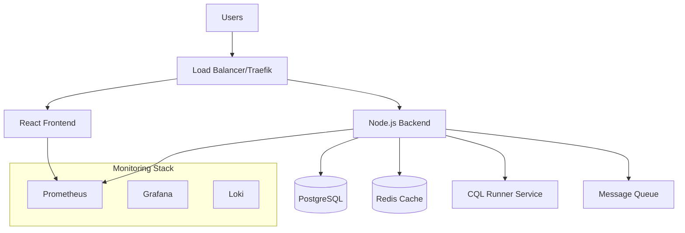

# CQL Code Clinic 🏥💻

**An Interactive Learning Platform for Clinical Quality Language (CQL)**

Transform your healthcare data analytics skills with our comprehensive, CodeAcademy-style learning platform. Master CQL through hands-on exercises, real-time code execution, and progressive skill building designed for healthcare professionals and developers.

[](LICENSE)
[](https://github.com/your-org/cql-code-clinic/actions)
[](SECURITY.md)
[](https://status.cqlclinic.com)

## ✨ Features

### 🎯 **Interactive Learning Experience**
- **Live Code Editor**: Monaco Editor with full CQL syntax highlighting and IntelliSense
- **Real-time Execution**: Execute CQL queries against real healthcare datasets
- **Instant Feedback**: Comprehensive error messages and debugging assistance
- **Progressive Difficulty**: From basic concepts to advanced healthcare analytics

### 🧠 **Intelligent Learning System**
- **Adaptive Hints**: AI-powered progressive disclosure system
- **Personalized Pathways**: Learning tracks tailored to your experience level
- **Interactive Tutorials**: Step-by-step guided experiences
- **Achievement System**: Unlock badges and track your progress

### 📊 **Comprehensive Analytics**
- **Progress Tracking**: Detailed analytics on your learning journey
- **Performance Metrics**: Track execution time, accuracy, and improvement
- **Learning Streaks**: Maintain momentum with daily practice goals
- **Skill Assessment**: Validate your CQL expertise with comprehensive tests

### 🔐 **Enterprise-Ready Platform**
- **Multi-user Support**: Individual accounts with role-based access
- **Security First**: Enterprise-grade security with audit logging
- **Performance Optimized**: Millisecond response times with intelligent caching
- **Scalable Architecture**: Built to handle thousands of concurrent users

## 🚀 Quick Start

### 🐳 Docker Quick Start (Recommended)

```bash
# Clone and start with one command
git clone https://github.com/your-org/cql-code-clinic.git
cd cql-code-clinic
docker-compose up -d

# Visit http://localhost:3000 to start learning!
```

### 💻 Local Development Setup

#### Prerequisites

- **Node.js 18+** ([Download](https://nodejs.org/))
- **Docker & Docker Compose** ([Install Guide](https://docs.docker.com/get-docker/))
- **Git** ([Download](https://git-scm.com/))

#### Setup Steps

1. **Clone and Setup**
   ```bash
   git clone https://github.com/your-org/cql-code-clinic.git
   cd cql-code-clinic
   
   # Install dependencies
   npm run install:all
   ```

2. **Configure Environment**
   ```bash
   # Copy environment files
   cp .env.example .env.development
   
   # Edit configuration (optional for development)
   nano .env.development
   ```

3. **Start Development Environment**
   ```bash
   # Start all services
   npm run dev
   
   # Or start individually
   npm run dev:frontend    # Frontend only
   npm run dev:backend     # Backend only
   npm run dev:services    # Database and cache only
   ```

4. **Access the Application**
   - **Frontend**: http://localhost:3000
   - **Backend API**: http://localhost:3001
   - **API Documentation**: http://localhost:3001/docs
   - **Database**: localhost:5432 (PostgreSQL)
   - **Cache**: localhost:6379 (Redis)

## 🏗️ Architecture Overview

### System Architecture



### Project Structure

```
cql-code-clinic/
├── 📁 frontend/                    # React 18 Application
│   ├── src/
│   │   ├── components/             # Reusable UI components
│   │   │   ├── auth/              # Authentication components
│   │   │   ├── exercises/         # Exercise-related components
│   │   │   ├── editor/            # Monaco editor components
│   │   │   └── common/            # Common UI components
│   │   ├── hooks/                 # Custom React hooks
│   │   ├── services/              # API services and utilities
│   │   ├── contexts/              # React context providers
│   │   ├── utils/                 # Utility functions
│   │   └── styles/                # Global styles and themes
│   ├── public/                    # Static assets
│   └── Dockerfile                 # Production container config
│
├── 📁 backend/                     # Node.js Express API
│   ├── src/
│   │   ├── controllers/           # Route controllers
│   │   ├── services/              # Business logic services
│   │   ├── middleware/            # Express middleware
│   │   ├── models/                # Database models
│   │   ├── routes/                # API route definitions
│   │   ├── utils/                 # Backend utilities
│   │   └── config/                # Configuration files
│   └── Dockerfile                 # Production container config
│
├── 📁 cql-runner/                  # CQL Execution Service
│   ├── src/                       # Java CQL execution engine
│   └── Dockerfile                 # CQL runner container
│
├── 📁 database/                    # Database configurations
│   ├── migrations/                # Database migration scripts
│   ├── seeds/                     # Sample data
│   └── init/                      # Initialization scripts
│
├── 📁 scripts/                     # Deployment and utility scripts
│   ├── deploy.sh                  # Main deployment script
│   ├── backup.sh                  # Automated backup script
│   └── health-check.sh            # Health monitoring script
│
├── 📁 monitoring/                  # Observability stack
│   ├── prometheus.yml             # Metrics collection config
│   ├── grafana/                   # Dashboards and datasources
│   └── alerts/                    # Alerting rules
│
├── 📁 .github/workflows/           # CI/CD pipelines
│   └── deploy.yml                 # Automated deployment
│
├── 📁 docs/                        # Comprehensive documentation
│   ├── api/                       # API documentation
│   ├── user-guide/                # User manuals
│   └── developer/                 # Development guides
│
├── docker-compose.yml              # Production orchestration
├── docker-compose.dev.yml          # Development environment
├── DEPLOYMENT.md                   # Deployment guide
├── SECURITY.md                     # Security documentation
└── README.md                       # This file
```

## 🧪 Technology Stack

### **Frontend**
- **React 18** - Modern UI framework with concurrent features
- **Vite** - Lightning-fast development and build tool
- **React Bootstrap** - Responsive UI components
- **Monaco Editor** - VS Code-powered code editor
- **TanStack Query** - Powerful data fetching and caching
- **React Router v6** - Client-side routing

### **Backend**
- **Node.js 18** - High-performance JavaScript runtime
- **Express.js** - Fast, unopinionated web framework
- **Prisma ORM** - Type-safe database access
- **PostgreSQL** - Robust relational database
- **Redis** - In-memory caching and session storage
- **Winston** - Professional logging framework

### **Infrastructure**
- **Docker** - Containerization platform
- **Docker Compose** - Multi-container orchestration
- **Traefik** - Modern reverse proxy with auto-SSL
- **Prometheus** - Metrics collection and alerting
- **Grafana** - Observability and analytics platform

### **Security**
- **JWT** - Stateless authentication
- **Helmet.js** - Security headers middleware
- **Rate Limiting** - DDoS and abuse protection
- **Input Validation** - XSS and injection prevention
- **HTTPS** - End-to-end encryption

## 🎓 Learning Pathways

### **Beginner Track** 
*Perfect for healthcare professionals new to CQL*

1. **Introduction to CQL** - Basic syntax and concepts
2. **Data Types and Variables** - Working with clinical data
3. **Simple Expressions** - Your first CQL calculations
4. **Filtering Data** - Finding relevant patient records
5. **Basic Functions** - Common CQL operations

### **Intermediate Track**
*For developers with basic CQL knowledge*

6. **Advanced Filtering** - Complex query conditions
7. **Working with Dates** - Temporal operations
8. **Code Systems and Concepts** - Terminology integration
9. **Library Development** - Modular CQL design
10. **Testing and Debugging** - Quality assurance practices

### **Advanced Track**
*For experienced CQL developers*

11. **Performance Optimization** - Efficient query design
12. **Complex Clinical Logic** - Real-world scenarios
13. **Integration Patterns** - CQL in practice
14. **Quality Measure Development** - HEDIS and CMS measures
15. **Advanced Analytics** - Population health insights

## 🎮 Interactive Features

### **Code Editor Experience**
- **Syntax Highlighting** - Full CQL language support
- **IntelliSense** - Smart code completion
- **Error Detection** - Real-time syntax validation
- **Code Formatting** - Automatic code beautification
- **Debugging Tools** - Step-through execution

### **Learning Assistance**
- **Progressive Hints** - Get help when you need it
- **Interactive Tutorials** - Guided learning experiences
- **Code Examples** - Copy-paste ready snippets
- **Reference Materials** - Built-in documentation
- **Community Support** - Help from other learners

### **Progress Tracking**
- **Skill Assessment** - Validate your knowledge
- **Achievement Badges** - Celebrate milestones
- **Learning Streaks** - Daily practice goals
- **Performance Analytics** - Track your improvement
- **Certification Paths** - Professional credentials
├── docker-compose.yml       # Local development services
└── PROJECT_PLAN.md         # Detailed implementation plan
```

## 🛠️ Technology Stack

### Frontend
- **React 18** with TypeScript
- **Vite** for fast development and building
- **Tailwind CSS** for styling
- **Monaco Editor** for code editing (Phase 2)
- **TanStack Query** for server state management
- **Zustand** for local state management
- **React Router** for navigation

### Backend (Planned - Phase 1)
- **Node.js** with Express.js and TypeScript
- **Prisma ORM** with PostgreSQL
- **Redis** for caching and sessions
- **JWT** authentication with Passport.js

### Development Tools
- **TypeScript** for type safety
- **ESLint** and **Prettier** for code quality
- **Vitest** for testing
- **Docker** for local services

## 📋 Available Scripts

### Root Scripts
- `npm run setup` - Complete development environment setup
- `npm run dev:frontend` - Start frontend development server
- `npm run build:frontend` - Build frontend for production
- `npm run test:frontend` - Run frontend tests
- `npm run lint:frontend` - Lint frontend code
- `npm run type-check:frontend` - Check TypeScript types

### Frontend Scripts (in ./frontend/)
- `npm run dev` - Start development server
- `npm run build` - Build for production
- `npm run test` - Run tests in watch mode
- `npm run test:coverage` - Run tests with coverage
- `npm run lint` - Lint code
- `npm run type-check` - Check TypeScript types

## 🎯 Current Status

### ✅ Phase 0: React Project Setup (Completed)
- React TypeScript project with Vite
- Tailwind CSS styling system
- Component library foundation
- Testing setup with Vitest
- Development tooling and scripts

### 🚧 Coming Next: Phase 1 - Foundation and Infrastructure
- Local CQL runner setup
- Backend API development  
- Component migration from Vue.js
- Enhanced error handling

## 🧪 Testing

Run the test suite:
```bash
npm run test:frontend
```

Run with coverage:
```bash
cd frontend && npm run test:coverage
```

## 🏃‍♂️ Development

### Start Development Server
```bash
npm run dev:frontend
```

The app will be available at [http://localhost:3000](http://localhost:3000)

### Code Quality

Format code:
```bash
npm run format
```

Lint code:
```bash
npm run lint:frontend
```

Type check:
```bash
npm run type-check:frontend
```

### Environment Variables

Copy the example environment file and customize:
```bash
cp frontend/.env.example frontend/.env.local
```

Available variables:
- `VITE_API_BASE_URL` - Backend API URL (default: http://localhost:3001/api)
- `VITE_DEMO_MODE` - Enable demo mode features
- `VITE_ENABLE_DEBUG` - Enable debug logging

## 📖 Learning Path

The platform will provide a structured learning path through CQL concepts:

1. **Basics** - Whitespace, comments, syntax fundamentals
2. **Data Types** - Numbers, strings, booleans, dates
3. **Operators** - Arithmetic, comparison, logical operators
4. **Expressions** - Simple and complex expressions
5. **Functions** - Built-in and custom functions
6. **Data Access** - Working with clinical data
7. **Advanced Topics** - Complex queries and optimization

## 🤝 Contributing

We welcome contributions! Please see our [Contributing Guide](CONTRIBUTING.md) for details.

### Development Workflow

1. Fork the repository
2. Create a feature branch: `git checkout -b feature/amazing-feature`
3. Make your changes
4. Run tests: `npm run test`
5. Commit your changes: `git commit -m 'Add amazing feature'`
6. Push to the branch: `git push origin feature/amazing-feature`
7. Open a Pull Request

## 📝 License

This project is licensed under the MIT License - see the [LICENSE](LICENSE) file for details.

## 🆘 Support

- 📖 [Documentation](docs/) (coming in Phase 7)
- 🐛 [Issue Tracker](https://github.com/your-repo/issues)
- 💬 [Discussions](https://github.com/your-repo/discussions)

## 📈 Roadmap

See [PROJECT_PLAN.md](PROJECT_PLAN.md) for the detailed implementation roadmap covering all 7 phases of development.

---

Built with ❤️ for the CQL community